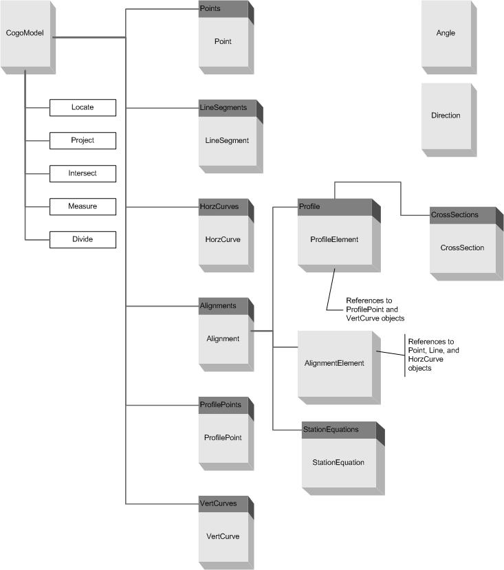

COGO Model {#WBFL_COGO_CogoModel}
===============
The CogoModel is the main object for this library. The CogoModel manages all of the geometric entities in the model.

The following diagram shows the relationships between the various objects in a CogoModel. This should help serve as a road map when using this library. If you plan to do some programming using this library, it is probably worth printing this picture and keeping it close at hand.

