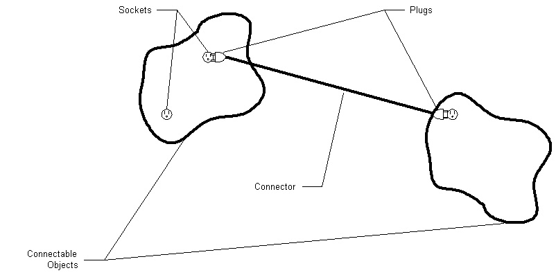

# Connectable Objects {#connectables}

In a direct manipulation it is common for two display objects to be connected together by a line or other such connector. When one display object is moved, the connector is adjusted. The WBFL DManip framework supports such connections with connectable objects.

# Connectable Objects
Most all of the display objects implemented in this framework are connectable. That is, they can have connectors attached to them. Connectable objects implement the iConnectable interface and have one default socket.

Much like an electrical connection, connections are made by sticking a plug into a socket. Sockets are generally located on the perimeter of a display object, but this isn't necessary. Through the iConnectable interface you can add a socket at any point in world space.

# Connector Objects
This framework implements two connector objects by default, Line and DimensionLine. Connectors are simply display objects that implement the iConnector interface. A connector has two properties, a StartPlug and an EndPlug. When these plugs are put into sockets on two different connectable display objects, a connection is made.

