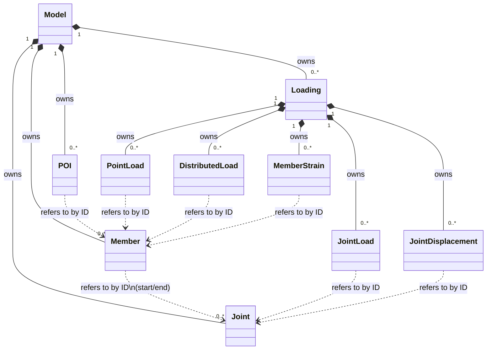

# Object Model {#WBFL_FEA2D_Object_Model}

The following diagram shows the high-level relationships between the classes in FEA2D. It's worth keeping close at hand when working with the engine.

Every joint, member, loading, and load is created through - and owned by - the object above it in this diagram (see @ref WBFL_FEA2D_Using_this_library); nothing but `Model` is ever created directly. A `Member` refers to its start and end `Joint` by ID rather than owning them, since a `Joint` is typically shared by more than one member - the same by-ID reference pattern is used everywhere else a load needs to point at the joint or member it's applied to.
