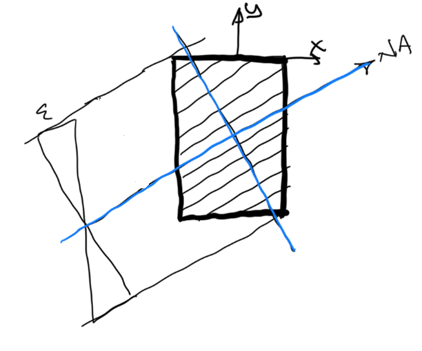
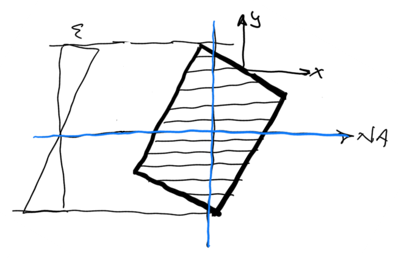

Internals {#WBFL_RCSection_Internals}
========================================================
This topic discuss some of the internal implementation details of the RCSection services.

Pimpl Idiom
------------
The pimpl idiom is used throught this library. The idea of the pimple idiom is to shield users of this library from the internal implementation details. Changes in implementation should not effect users of this library and should not necessitate compling when the internal implementation details are modified.

* https://docs.microsoft.com/en-us/cpp/cpp/pimpl-for-compile-time-encapsulation-modern-cpp
* https://www.geeksforgeeks.org/pimpl-idiom-in-c-with-examples/

Section Slicing
----------------
The general section solver “slices” the shapes that are composed into a GeneralSection for the fiber-based strain compatibility analysis. The section must be discretized into slices that are parallel to the neutral axis. 

The WBFL::Geometry::Shape::CreateClippedShape function is used, passing it a clipping rectangle for each slice. The sides of the clipping rectangle must be aligned with the globally X-Y coordinate system. 

For cases when the neutral axis is rotated, the shape must be rotated in the opposite direction until the neutral axis is aligned with the positive X-axis.

Once rotated, the shape can be clipped. The individual slices are then rotated back to the original coordinate system and the strain compatibility solution is carried out.

