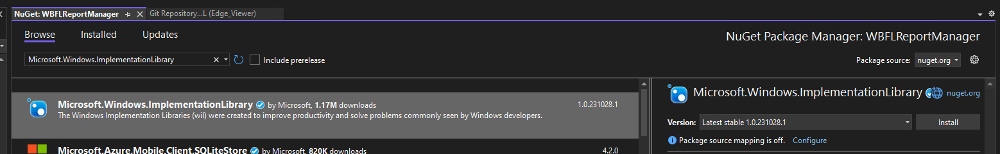

Introduction {#WBFL_Reporting}
================
This library provides Reporting Management services in the WBFL Application Services Layer.

Reporting Management services include:
* Managing report builders
* Creating reports
* Displaying reports
* UI elements for users to modify report specifications

Key Concepts
------------
The ReportBuilderManager provides services for managing ReportBuilder objects, proving a user interface element to allow a user to select and configure a ReportSpecification, and creating ReportBrowser objects to display a report.

ReportBuilder objects create WBFL::Reports::Report objects based on a user supplied ReportSpecification. A ReportBuilder consists of a TitlePageBuilder and collection of ChapterBuilder objects. The ChapterBuilder objects create the chapters of a report and fill them with the report's content.

A ReportSpecification defines the chapters to be included in a report, chapter reporting level, and other report content such as headers and footers.

Dependencies
------------
The ReportManager library has additional dependencies for the WebView2 browser control. 
In the Solution Explorer window, right click on the WBFLReportManager project and select `Manage NuGet Packages...`

Select the `Browse` tab and search `Microsoft.Windows.ImplementationLibrary`

Select the NuGet package and install with the `Install` button

Select the `Installed` tab and confirm both `Microsoft.Web.WebView2` and `Microsoft.Windows.ImplementationLibrary` are installed. If `Microsoft.Web.WebView2` is missing, return to the `Browse` tab, search for `Microsoft.Web.WebView2` and install it.