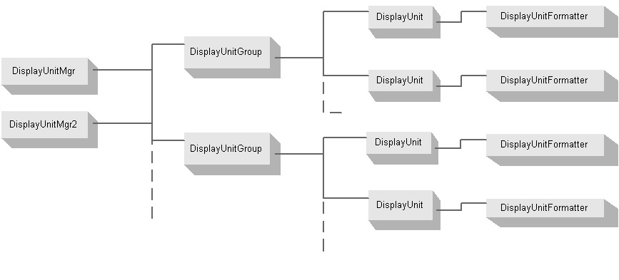

Display Units {#WBFL_UnitServer_DisplayUnits}
=============

Most engineering components and applications work in a consistent set of internal units. Often times these units are not the units the user wants to work in. For example, internal to an application length might be measured in inches but users want to input length in feet or meters. Display units create the bridge between the units of measure the user works with and the units of measure the programmer works with.

The display unit services provided by the WBFL Unit Server consist of a display unit manager (DisplayUnitMgr or DisplayUnitMgr2), collections of display units types (DisplayUnitGroup) and DisplayUnit objects.

Display Unit Manager
--------------------
The display unit manager is responsible for managing display unit groups. The display unit manager also provides methods to convert between display units and base units.

The WBFL Unit Server implements two display unit managers, DisplayUnitMgr and DisplayUnitMgr2. Both of these object manage display units exactly the same. These two object differ in the way they deal with unit conversion.

DisplayUnitMgr is designed to work with Single Document Interface (SDI) applications. In this sort of application there is a single document and a single unit mode. Because there is only one document the display unit manager is coupled to the document and can offer formatting and unit conversion servers.

DisplayUnitMgr2 is designed to work with Multiple Document Interface (MDI) applications. In this soft of application there can be one or more documents and each document can have its unit mode set to SI or English. In the MDI case, the unit mode and the display unit manager cannot be directly coupled. The formatting and unit conversion tasks are handled by the DocUnitSystem object.

Display Unit Group
--------------------
It is often convienent to group display units into categories. For example, an application might have two types of length input. One input represents the span length of a bridge and the other represents dimensions of a girder cross section. Typically you will want to present the span lengths in units of feet or meters and the cross section dimensions in units of inches or millimeters. Even though the physical unit type is the same (Length), the display units are much different. The DisplayUnitGroup object allows you to logically group different type of display units and then refer to them by a simple name. In this example you might use a group called "LongLength" and another group called "ShortLength". Now, when ever you want to convert a number in the "LongLength" group, you simply use the conversion methods provided by the framework and refer to the "LongLength" group. The display unit manager takes care of the rest.

Display Unit and the DisplayUnitFormatter
------------------------------------------
A display unit brings together a unit of measure and formatting information to create a formatted display unit string. In the example given above, "LongLength" has a unit type of "Length" and a unit of measure of "Feet" or "Meters". The DisplayUnitGroup for "LongLength" will have two DisplayUnit objects, one for each unit of measure. Typically, you will want to format the display of a distance in feet differently than a distance in meters. This is the job of the DisplayUnitFormatter.

The DisplayUnit object for "feet" will have a reference to the Unit object for "feet" and a DisplayUnitFormatter object that knows how to format the display string. The DisplayUnitFormatter object has properties such as Justification, Precision, and Width that control the appearance of the formatted display unit string.

The AnnotatedDisplayUnit object is used for special formatting such as feet and inches (10'-3") or stationing (9+45.12).