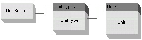

Unit Conversions {#WBFL_UnitServer_UnitConversions}
================
Unit conversions are something all engineers are familar with so we will skip a drawn out discussion on the topic. In its most simple form, the WBFL Unit Server can be used to perform unit conversions within a unit system and between the US and SI unit systems.

The unit server object manages collections of physical unit types such as "Length" and "Force". Each unit type manages instances of the physcial units such as "feet" and "kips". The UnitServer object model is shown below.

Units are converted using the following formula:

\f[
v_2 = \frac{(v_1+A_1)C_1+B_1 - B_2}{C_2} - A_2
\f]

where,

\f$ v_1 \f$ = The value to be converted

\f$ v_2 \f$ = The converted value

\f$ A_1 \f$ = Prefix term for Unit 1

\f$ C_1 \f$ = Conversion factor for Unit 1

\f$ B_1 \f$ = Postfix term for Unit 1

\f$ A_2 \f$ = Prefix term for Unit 2

\f$ C_2 \f$ = Conversion factor for Unit 2

\f$ B_2 \f$ = Postfix term for Unit 2

When converting to base units \f$ A_1 = B_1 = 0 \f$ and \f$ C_1 = 1.0 \f$. When converting from base units \f$ A_2 = B2 = 0 \f$ and \f$ C_2 = 1.0 \f$.