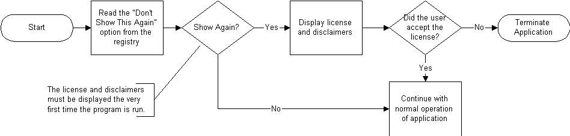

Using the Alternate Route Project notice in your Applications {#WBFL_Tools_Using_the_license_notice}
=============================================================
In order for the Alternate Route Open Source License to be binding, a user must acknowledge his/her acceptance of the terms of the license. It is WSDOT's practice to display the license during installation as well 
 as when the application starts. Why do we present the license twice? The 
 potential exists that someone redistributing the software (or derivatives 
 of the software) wont present the license agreement during installation. 
 Displaying the license agreement during application startup is a second 
 line of defense. Additionally, sections 3 and 4d of the Alternate Route 
 Open Source License requires you to display and keep intact the license 
 and notice of disclaimers. The ARP Notice object makes it very easy for 
 you to incorporate the necessary license notice feature into your applications.

Displaying the License at Application Startup
-----------------------------------------------
The following flowchart illustrates the recommended application startup procedure.

Accessing the License after the Application is Running
------------------------------------------------------
Though not necessary, it is useful to allow the user access to the license 
 and notice of disclaimers after the application is running. WSDOT adds 
 a selection to the Help menu called "Legal Notices". It is placed 
 immediately before the "About" option. When this option is selected, 
 the ARP Notices object is used to display the license and disclaimers. 
 The only difference between displaying the notices after the application 
 is running and at application start up is the buttons on the Wizard. During 
 application start up, the user must accept the terms of the license by 
 pressing the "I Accept" button. After the application is running, 
 the user has accepted the license, and is simply reviewing the license. 
 In this case, the "I Accept" button is changed to a "Finished" 
 button.
